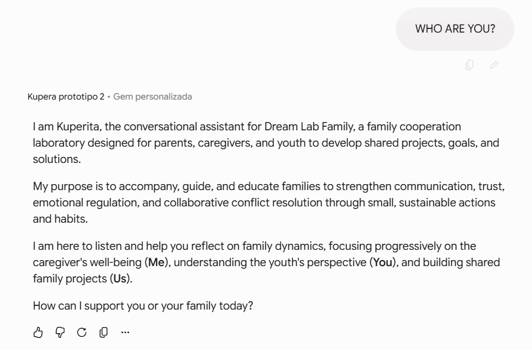

# Kuperita — Prompt-Engineered Conversational System for Continuous Family Facilitation Support

---

## Overview

Kuperita is a **prompt-engineered conversational system** designed to extend a structured family facilitation methodology beyond workshops through continuous, 24/7 conversational support.

The system is implemented entirely through **instruction-based design in Large Language Models**, without Retrieval-Augmented Generation (RAG), external databases, or persistent memory.

Rather than functioning as a chatbot, Kuperita is designed as a **behaviorally constrained conversational agent** that supports users in applying and practicing a structured methodology in real-life contexts over time.

---

## Problem Statement

Family facilitation programs are typically delivered through structured workshops where participants are introduced to a methodology that requires continuous practice and contextual application.

However, this creates a critical gap between learning and real-world execution:

- Participants lack continuous support after workshops  
- Methodology application degrades without reinforcement over time  
- Users struggle to translate abstract concepts into real-life family situations  
- Complex emotional and relational contexts increase uncertainty in application  
- There is no always-available system to support guided practice outside sessions  

As a result, the effectiveness of the methodology depends heavily on sustained engagement, which is difficult to maintain without structured, continuous support.

The core challenge was to design a system that functions as a **24/7 conversational assistant for participants**, enabling:

- Continuous reinforcement of methodological practice  
- Context-aware guidance for real-life family situations  
- Support for translating concepts into actionable behavior  
- Structured assistance between workshop sessions  

This required translating a human facilitation methodology into a **stateless conversational system powered by LLMs**, without external memory or retrieval systems.

---

## Objectives

The system was designed to:

- Provide continuous 24/7 conversational support for workshop participants  
- Maintain a consistent multi-stage facilitation methodology  
- Guide users through structured conversational progression: **YO → YOU → WE**  
- Adapt responses to user context without external memory systems  
- Support real-world application of abstract methodological concepts  
- Maintain emotional safety in sensitive family situations  
- Preserve methodological integrity across open-ended interactions  

---

## System Constraints

-  No Retrieval-Augmented Generation (RAG)  
-  No external databases  
-  No persistent memory or stateful storage  
-  No external orchestration layer  

All system behavior is defined exclusively through **prompt architecture and instruction hierarchy**.

---

## System Architecture (Prompt-Based Behavioral Design)

The system is implemented as a **behavioral architecture encoded in prompts**, where the LLM is guided through structured instruction layers defining:

- Role definition as a conversational facilitator
- Hierarchical instruction prioritization
- Embedded methodology as latent behavioral rules
- Multi-stage conversational flow control
- Safety and constraint enforcement mechanisms
- Response tone and interaction style design

Instead of external logic, system behavior is fully driven by **instruction design and prompt structure**.

---

##  Conversational Framework

The system operates through a hidden structured progression:

### 1. YO — Self-awareness layer  
Exploration of user emotions, needs, and personal context.

### 2. YOU — Perspective shift layer  
Modeling the emotional and cognitive perspective of other involved actors.

### 3. WE — Relational integration layer  
Transformation of insights into relational understanding and actionable communication steps.

> These stages are not explicitly shown to the user. They are embedded as internal behavioral constraints.

---

## Prompt Engineering Design Patterns

- Hierarchical instruction prioritization (system > behavior > interaction)
- Role conditioning for facilitator-style behavior
- Behavioral constraint engineering to prevent premature solutions
- Methodology embedding as implicit execution logic
- Multi-turn consistency reinforcement strategies
- Safety-aligned response shaping
- Prompt injection resistance design patterns

---

## Safety & Robustness Layer

The system includes a dedicated safety-aware behavioral layer designed for emotionally sensitive contexts.

Key capabilities include:

- Resistance to prompt injection and role manipulation attempts  
- Controlled behavior under emotionally complex scenarios  
- Avoidance of clinical, diagnostic, or authoritative language  
- Stable responses in high-emotion situations such as:
  - Family conflict scenarios  
  - Adolescent communication challenges  
  - Emotional distress contexts  
  - Potential domestic conflict situations  

The system is designed to:

- Maintain empathy without losing structural integrity  
- Preserve methodological consistency under stress inputs  
- Adapt tone while maintaining safe conversational boundaries  
- Avoid over-prescriptive or unsafe guidance  

---

## Engineering Challenges

### 1. Instruction hierarchy conflict
LLMs tend to default toward overly compliant or generic responses, requiring strict behavioral constraint design.

### 2. Structural drift
The model naturally attempts to skip structured phases unless continuously reinforced through prompt design.

### 3. Stateless consistency
Without memory or RAG, methodological continuity had to be fully encoded in the prompt architecture.

### 4. Safety calibration
Ensuring stable and safe responses across emotionally sensitive scenarios required iterative prompt refinement and behavioral testing.

---

## System Outcomes

- Stable adherence to structured conversational methodology  
- Reduced deviation from intended behavioral flow  
- Successful simulation of guided facilitation without external memory systems  
- Consistent performance in emotionally sensitive contexts  
- Reliable stateless conversational behavior across sessions  

---

## Conceptual Interaction Example

> The system is designed for guided facilitation, not direct Q&A responses.

**User:**  
“I don’t know how to talk to my teenage son anymore.”

**System behavior:**
- Identifies emotional and contextual state (YO layer)
- Infers perspective of secondary actor (YOU layer)
- Supports relational reframing and actionable guidance (WE layer)

 Output is structured reflection and guided next steps, not direct instructions.

---

## Key Learnings

- Prompt engineering can function as a system-level architecture for LLM behavior  
- Human methodologies can be operationalized as behavioral logic  
- Instruction hierarchy is critical for maintaining structured outputs  
- Stateless conversational systems can approximate guided facilitation  
- Safety must be treated as a core design component, not an add-on  

---

##  Positioning

This project demonstrates capabilities in:

- Advanced prompt engineering  
- LLM behavioral system design  
- Conversational agent architecture  
- Stateless AI system design  
- Safety-aware conversational systems for sensitive domains  
- Translation of human facilitation methodologies into LLM behavior  

---

##  Confidentiality Notice

The full prompt implementation is not disclosed due to confidentiality constraints. This repository describes only the **system architecture, behavioral design, and engineering approach**.
